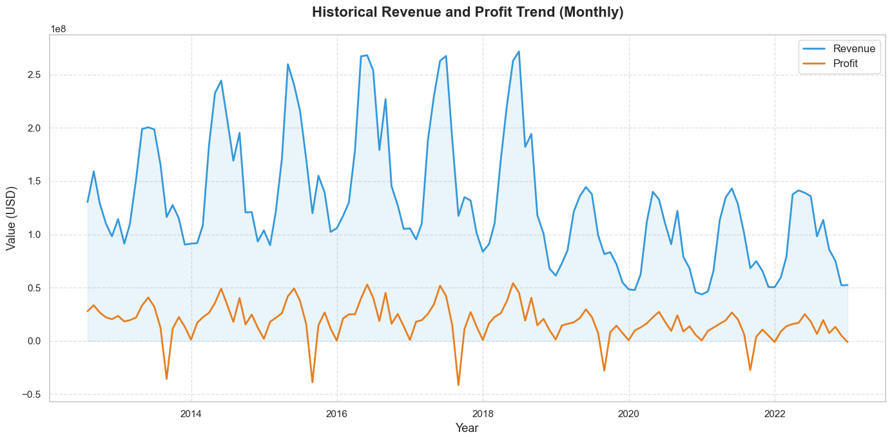
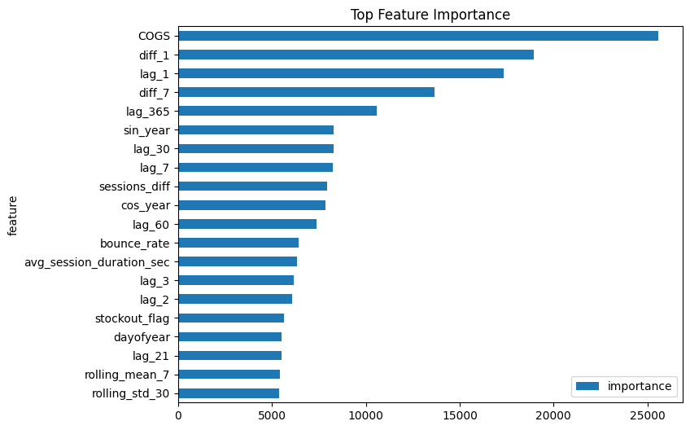
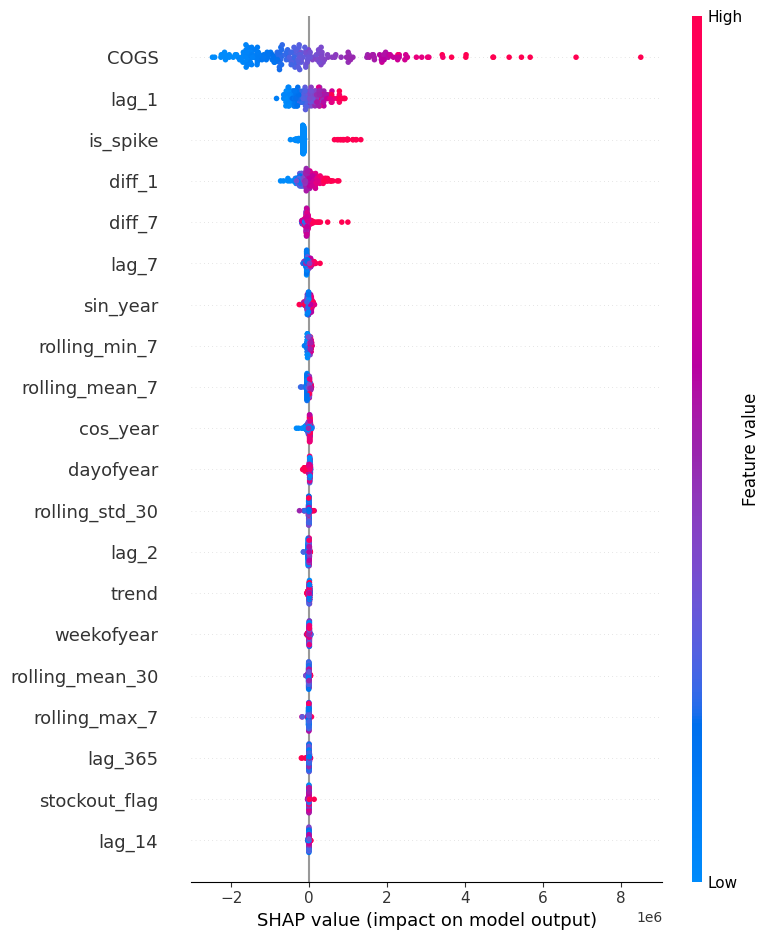

# 📊 E-commerce Analytics & Revenue Forecasting

[](https://www.python.org/)
[](https://lightgbm.readthedocs.io/)
[](https://scikit-learn.org/)

A comprehensive end-to-end data science project focused on e-commerce business intelligence. This repository covers everything from deep exploratory analysis and customer segmentation to high-accuracy revenue forecasting using state-of-the-art machine learning techniques.

---

## 📈 Executive Summary

The project aims to optimize e-commerce operations by:
1. **Understanding Growth**: Identifying key drivers of revenue and profit.
2. **Customer Intelligence**: Segmenting customers to predict Life-Time Value (CLV).
3. **Optimizing Marketing**: analyzing promotion elasticity and uplift.
4. **Predicting the Future**: Building a robust forecasting pipeline to manage inventory and expectations.



---

## 📂 Repository Structure

### 🔍 1. Exploratory Data Analysis (`EDA/`)
Deep dives into business performance and customer patterns:
*   `revenue_overview.ipynb`: Sales trends and seasonality analysis.
*   `Customer_Behavior.ipynb`: Purchase patterns and frequency heatmaps.
*   `Promotion_Analysis.ipynb`: Impact assessment of marketing campaigns.
*   `RFM_Segmentation_...ipynb`: Advanced clustering (BG/NBD & Gamma-Gamma).
*   `uplift_modeling.ipynb`: Measuring incremental impact of interventions.

### 🔮 2. Time Series Forecasting (`TimeSerie Forecasting/`)
Multi-step recursive forecasting for revenue planning:
*   `competition_forecast_pipeline.ipynb`: **[Main]** Integrated ARIMA + LightGBM pipeline.
*   `lightGBM.ipynb`: Experimental LightGBM implementation with custom feature engineering.
*   `Baseline_Sarima.ipynb`: Traditional statistical benchmark.

### 💾 3. Data & Utilities (`data/`)
*   `data/`: Cleaned CSV datasets for all business entities.
*   `ingest_to_sqlitedb.py`: Automated ETL to a structured database.

---

## 🚀 Model Performance & Insights

Our LightGBM model is highly optimized, focusing on key business drivers like COGS and previous lags.

<p align="center">
  
  
</p>

*   **Key Driver**: `COGS` and `lag_1` (yesterday's revenue) are the strongest predictors.
*   **Methodology**: Recursive forecasting with daily dynamic feature updates (40+ features per step).
*   **External Factors**: Integrated ARIMA models to forecast future `sessions` and `page_views`.

---

## 🛠️ Getting Started

### 1. Installation
Clone the repository and install the dependencies:

```bash
git clone https://github.com/your-repo/datathon.git
cd datathon
pip install -r requirements.txt
# If no requirements.txt, use:
pip install pandas numpy matplotlib seaborn lightgbm scikit-learn statsmodels
```

### 2. Reproduction
1.  **Initialize**: Run `data/ingest_to_sqlitedb.py` to prepare the data layer.
2.  **Explore**: Inspect the `EDA/` notebooks for insights into customer segments.
3.  **Predict**: Execute `TimeSerie Forecasting/competition_forecast_pipeline.ipynb`.
    *   The model will auto-train on historical data.
    *   It executes a 500+ step recursive loop.
    *   Results are exported to `submission.csv`.

---

